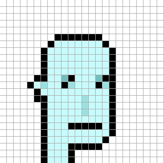

Crypto Collectibles Series -
[Cats](https://github.com/cryptocopycats/design.mooncats) ·
[Punks](https://github.com/cryptopunksnotdead/design.punks)


# Punk Design Series


## Original CryptoPunks Series (24×24)


All  basic designs in original pixel size -
humans (male / female), alien (male), ...
<!-- zombie, ape -->


For more see [**original »**](original)


## 1000 More CryptPunks Series (24x24)

More basic designs in original pixel size -
alien (female),  ...


For more see [**more »**](more)


## Tools

###  Do-It-Yourself (DIY) Corner - Yes, You Can! - Draw Your Own Free 24x24 Avatars That You Own 100% Forever

Try the Punk Pixel Drawing Tool online
=> [**cryptopunksnotdead.github.io**](https://cryptopunksnotdead.github.io/)

How does it work?

Yes, you can read in any design into the pixel drawing tool online.
Example for [alien-male](original/alien-male.txt):

```
. . . . . . . . . . . . . . . . . . . . . . . .
. . . . . . . . . . . . . . . . . . . . . . . .
. . . . . . . . . . . . . . . . . . . . . . . .
. . . . . . . . . . . . . . . . . . . . . . . .
. . . . . . . . . . . . . . . . . . . . . . . .
. . . . . . . . @ @ @ @ @ @ @ . . . . . . . . .
. . . . . . . @ ^ ^ ^ ^ ^ ^ ^ @ . . . . . . . .
. . . . . . @ ^ ^ ^ ^ ^ ^ ^ ^ ^ @ . . . . . . .
. . . . . . @ ^ ^ ^ ^ ^ ^ ^ ^ ^ @ . . . . . . .
. . . . . . @ ^ ^ ^ ^ ^ ^ ^ ^ ^ @ . . . . . . .
. . . . . . @ ^ ^ ^ ^ ^ ^ ^ ^ ^ @ . . . . . . .
. . . . . @ @ ^ ^ x @ ^ ^ ^ x @ @ . . . . . . .
. . . . @ ^ o ^ ^ @ o ^ ^ ^ @ o @ . . . . . . .
. . . . . @ ^ ^ ^ ^ ^ ^ ^ ^ ^ ^ @ . . . . . . .
. . . . . @ @ ^ ^ ^ ^ ^ o ^ ^ ^ @ . . . . . . .
. . . . . . @ ^ ^ ^ ^ ^ o ^ ^ ^ @ . . . . . . .
. . . . . . @ ^ ^ ^ ^ ^ o ^ ^ ^ @ . . . . . . .
. . . . . . @ ^ ^ ^ ^ ^ ^ ^ ^ ^ @ . . . . . . .
. . . . . . @ ^ ^ ^ @ @ @ @ @ ^ @ . . . . . . .
. . . . . . @ ^ ^ ^ ^ ^ ^ ^ ^ ^ @ . . . . . . .
. . . . . . @ ^ ^ ^ ^ ^ ^ ^ ^ @ . . . . . . . .
. . . . . . @ ^ ^ ^ @ @ @ @ @ . . . . . . . . .
. . . . . . @ ^ ^ ^ @ . . . . . . . . . . . . .
. . . . . . @ ^ ^ ^ @ . . . . . . . . . . . . .
```

Paste the text into the box below the pixel grid canvas and click on the read button.
Now you should see the punk pixel design.





## Questions? Comments?

Post them on the [CryptoPunksDev reddit](https://old.reddit.com/r/CryptoPunksDev). Thanks.